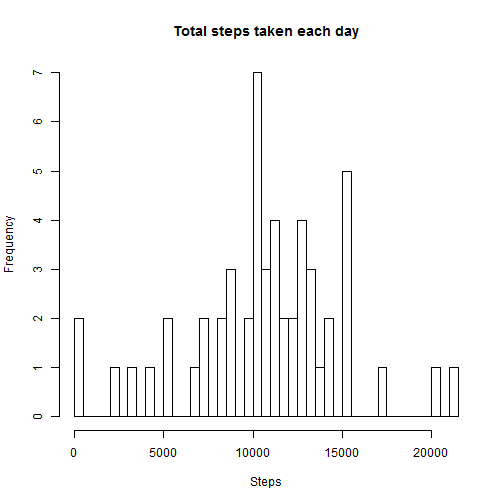
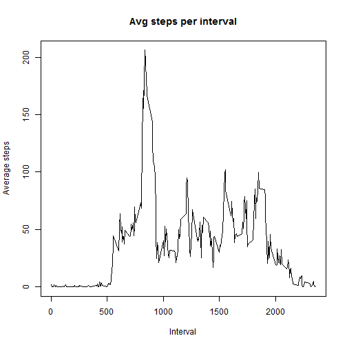
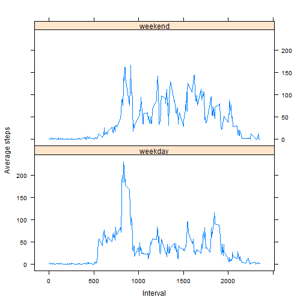

# "Reproducible Research: Peer Assessment 1"
# 
## Loading and preprocessing the data
Preconditions for this exercise are that the data is downloaded and unzipped to the working directory.

```r
    setwd("C:/Users/Dave/Documents/Davework/datascience/Reproducible research/")
    act <- tbl_df(read.csv("./activity.csv", header=TRUE, na.strings="NA", stringsAsFactors = FALSE))
```
## What is mean total number of steps taken per day?
Aggregate will only perform the function (in this case "sum") when there is data, i.e. not all NA's, as there are for some days in this dataset.

```r
    total_steps <- aggregate(steps ~ date, data=act, sum)
    hist(total_steps$steps, xlab="Steps", main="Distribution of steps taken per day", breaks=nrow(total_steps))
```

 

Calculate mean and median steps per day:

```r
    print(mean(total_steps$steps))
```

```
## [1] 10766
```

```r
    print(median(total_steps$steps))
```

```
## [1] 10765
```
## What is the average daily activity pattern?
This is a time series plot of the total number of steps taken in each interval across all days.

```r
    by_interval_mean <- aggregate(steps ~ interval, data=act, mean, na.rm=TRUE)
        plot(steps ~ interval, by_interval_mean, type="l", xlab="Interval", 
            ylab = "Average steps", main="Avg steps per interval")
```

 

Which 5 minute interval contains the max number of steps?

```r
    by_interval_mean[which.max(by_interval_mean$steps),]$interval
```

```
## [1] 835
```
This is about 1/3 of the way through the full data interval set of 2400, so roughly 8:30 in the morning has the highest activity.

## Imputing missing values
There are a number of days/intervals where there are missing values (coded as NA). The presence of missing days may introduce bias into some calculations or summaries of the data.  

We first calulate the total number of missing values:

```r
    na <- colSums(is.na(act))
    print(na)
```

```
##    steps     date interval 
##     2304        0        0
```

This indicates that there are only NA's in the "steps" column.
Next we use the mean for each 5 minute interval for all days to fill in the NA's.


```r
    total_act <- merge(act, by_interval_mean, by = "interval")
    total_act$impsteps <- ifelse(is.na(total_act$steps.x), total_act$steps.y, total_act$steps.x)
    total_act_day <- aggregate(impsteps ~ date, data = total_act, FUN=sum)
    names(total_act_day) <- c("date","total_imputed_steps")
    hist(total_act_day$total_imputed_steps, xlab="Steps", main="Distribution of steps taken per day", breaks=nrow(total_steps))
```

 

Now recalculate the mean and median for the whole dataset, including the added imputed step counts.

```r
    print(mean(total_act_day$total_imputed_steps))
```

```
## [1] 10766
```

```r
    print(median(total_act_day$total_imputed_steps))
```

```
## [1] 10766
```

The impact of imputing missing data on the estimates of the total daily number of steps is small, as would be expected.  We added an average value for the missing data, therefore it's natural that the mean and median would change very little.
## Are there differences in activity patterns between weekdays and weekends?
To answer this question, first create a new factor variable in the dataset with two levels - "weekday" and "weekend" indicating whether a given date is a weekday or weekend day.  Then aggregate the dataset into those two buckets.

```r
    total_act$day_type <- factor(ifelse(weekdays(as.Date(total_act$date)) %in% c("Saturday", "Sunday"), "weekend", "weekday"))
    act_weekdays <- aggregate(total_act$impsteps, by=list(total_act$day_type, total_act$interval), FUN=mean)
    names(act_weekdays) <- c("day_type", "interval","steps")
```
Finally, make a panel plot containing a time series plot of the 5-minute interval (x-axis) and the average number of steps taken, averaged across all weekday days or weekend days (y-axis)

```r
    library("lattice")
    xyplot(act_weekdays$steps ~ act_weekdays$interval | act_weekdays$day_type, type = "l", xlab="Interval", ylab="Average steps", layout = c(1,2))
```

 
