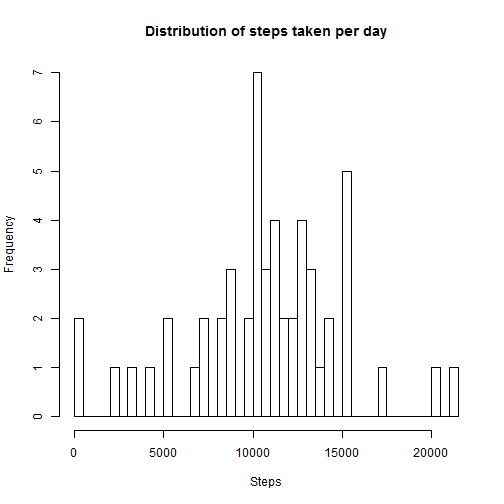

## Loading and preprocessing the data

```r
    setwd("C:/Users/Dave/Documents/Davework/datascience/Reproducible research/")
    act <- tbl_df(read.csv("./activity.csv", header=TRUE, na.strings="NA", stringsAsFactors = FALSE))
```
## What is mean total number of steps taken per day?
Aggregate will only perform the function (in this case "sum") when there is data, i.e. not all NA's as there are for some days in this dataset.


```r
    total_steps <- aggregate(steps ~ date, data=act, sum)
    hist(total_steps$steps, xlab="Steps", main="Total steps taken each day", breaks=nrow(total_steps))
```

 
Calculate mean and median steps per day

```r
    print(mean(total_steps$steps))
```

```
## [1] 10766
```

```r
    print(median(total_steps$steps))
```

```
## [1] 10765
```
## What is the average daily activity pattern?
Create plot 2, a time series plot of the total number of steps taken each day.

```r
    by_interval_mean <- aggregate(steps ~ interval, data=act, mean, na.rm=TRUE)
        plot(steps ~ interval, by_interval_mean, type="l", xlab="Interval", 
            ylab = "Average steps", main="Avg steps per interval")
```

 
Which 5 minute interval contains the max number of steps?

```r
    by_interval_mean[which.max(by_interval_mean$steps),]$interval
```

```
## [1] 835
```

## Imputing missing values
First calulate total number of missing values

```r
    na <- colSums(is.na(act))
    print(na)
```

```
##    steps     date interval 
##     2304        0        0
```
Then use the mean for each 5 minute interval for all days


```r
    total_act <- merge(act, by_interval_mean, by = "interval")
    total_act$impsteps <- ifelse(is.na(total_act$steps.x), total_act$steps.y, total_act$steps.x)
    total_act_day <- aggregate(total_act$impsteps, by=list(total_act$date), FUN=sum)
    names(total_act_day) <- c("date","total_imputed_steps")
    
    hist(total_act_day$total_imputed_steps, xlab="Steps", main="Total steps taken each day", breaks=nrow(total_steps))
```

 

```r
    print(mean(total_act_day$total_imputed_steps))
```

```
## [1] 10766
```

```r
    print(median(total_act_day$total_imputed_steps))
```

```
## [1] 10766
```
## Are there differences in activity patterns between weekdays and weekends?

```r
total_act$day_type <- factor(ifelse(weekdays(as.Date(total_act$date)) %in% c("Saturday", "Sunday"), "weekend", "weekday"))
    act_weekdays <- aggregate(total_act$impsteps, by=list(total_act$day_type, total_act$interval), FUN=mean)
    names(act_weekdays) <- c("day_type", "interval","steps")
    library("lattice")
    xyplot(act_weekdays$steps ~ act_weekdays$interval | act_weekdays$day_type, type = "l", layout = c(1,2))
```

 
